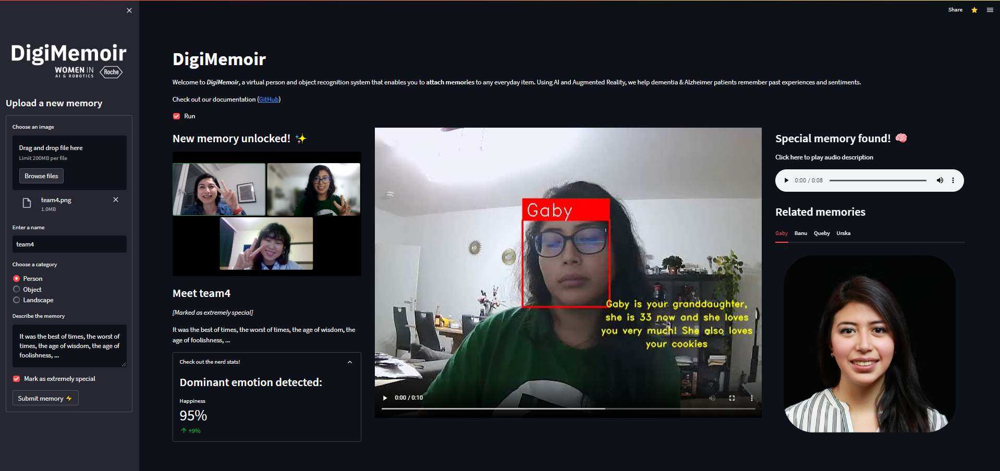

# Memory Loop 👵👴🧓

Memory Loop helps people with dementia remember daily objects and their loved ones. The app captures moments with objects & people and stores the stories associated with them. Whenever the person focuses on an object or person, the digital memory will start talking about it, reminding the person of the history behind that object or person.



## 📌 How to run
```bash
streamlit run app.py
```

## Features
- **Facial Recognition** - Identify and remember loved ones
- **Object Recognition** - Recognize everyday objects and their stories
- **Memory Storage** - Save and retrieve personal memories
- **Text-to-Speech** - Hear stories about people and objects

## ✨ Team
- Gabriela Cortés
- Nathanya Queby S.
- Banu Turkmen
